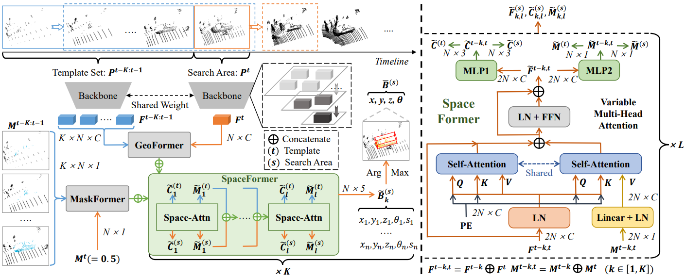

# [AAAI 2024] M3SOT: Multi-frame, Multi-field, Multi-space 3D Single Object Tracking

The official code release of [M3SOT](https://arxiv.org/pdf/2312.06117.pdf).

## M3SOT

3D Single Object Tracking (SOT) stands a forefront task of computer vision, proving essential for applications like autonomous driving. Sparse and occluded data in scene point clouds introduce variations in the appearance of tracked objects, adding complexity to the task. In this research, we unveil M3SOT, a novel 3D SOT framework, which synergizes ***multiple*** input frames (template sets), ***multiple*** receptive fields (continuous contexts), and ***multiple*** solution spaces (distinct tasks) in ONE model. Remarkably, M3SOT pioneers in modeling temporality, contexts, and tasks directly from point clouds, revisiting a perspective on the key factors influencing SOT. To this end, we design a transformer-based network centered on point cloud targets in the search area, aggregating diverse contextual representations and propagating target cues by employing historical frames. As M3SOT spans varied processing perspectives, we've streamlined the network—trimming its depth and optimizing its structure—to ensure a lightweight and efficient deployment for SOT applications. We posit that, backed by practical construction, M3SOT sidesteps the need for complex frameworks and auxiliary components to deliver sterling results. Extensive experiments on benchmarks such as KITTI, nuScenes, and Waymo Open Dataset demonstrate that M3SOT achieves state-of-the-art performance at 38 FPS.

<p align="center">

</p>

## Setup

Following [CXTrack](https://github.com/slothfulxtx/cxtrack3d), we list the most important part of our dependencies

| Dependency        | Version |
| ----------------- | ------- |
| open3d            | 0.15.2  |
| python            | 3.8.0   |
| pytorch           | 1.8.0   |
| pytorch-lightning | 1.5.10  |
| pytorch3d         | 0.6.2   |
| shapely           | 1.8.1   |
| torchvision       | 0.9.0   |

Others can be seen in [Open3DSOT](https://github.com/Ghostish/Open3DSOT).

### KITTI

+ Download the data for [velodyne](http://www.cvlibs.net/download.php?file=data_tracking_velodyne.zip), [calib](http://www.cvlibs.net/download.php?file=data_tracking_calib.zip) and [label_02](http://www.cvlibs.net/download.php?file=data_tracking_label_2.zip) from [KITTI Tracking](http://www.cvlibs.net/datasets/kitti/eval_tracking.php).
+ Unzip the downloaded files.
+ Put the unzipped files under the same folder as following.
  ```
  [Parent Folder]
  --> [calib]
      --> {0000-0020}.txt
  --> [label_02]
      --> {0000-0020}.txt
  --> [velodyne]
      --> [0000-0020] folders with velodynes .bin files
  ```
### Waymo Open Dataset

* We follow the benchmark created by [LiDAR-SOT](https://github.com/TuSimple/LiDAR_SOT) based on the waymo open dataset. You can download and process the waymo dataset as guided by [LiDAR_SOT](https://github.com/TuSimple/LiDAR_SOT), and use our code to test model performance on this benchmark.
* The following processing results are necessary.
```
[waymo_sot]
    [benchmark]
        [validation]
            [vehicle]
                bench_list.json
                easy.json
                medium.json
                hard.json
            [pedestrian]
                bench_list.json
                easy.json
                medium.json
                hard.json
    [pc]
        [raw_pc]
            Here are some segment.npz files containing raw point cloud data
    [gt_info]
        Here are some segment.npz files containing tracklet and bbox data
```

### NuScenes

We follow [V2B](https://github.com/fpthink/V2B) to prepare the nuscenes dataset (v1.0), and we also cite the following sentences from [STNet](https://github.com/fpthink/STNet).


> Since both kitti and waymo are datasets constructed from 64-line LiDAR, nuScenes is a 32-line LiDAR. We recommend you: train your model on KITTI and verify the generalization ability of your model on waymo. Train on nuScenes or simply skip this dataset. We do not recommend that you verify the generalization ability of your model on nuScenes. 

**Tips: If you have the wrong version of NuScenes dependencies, you will most likely not reproduce our results.**

## Get Started

### Training

To train a model, you must specify the `.yaml` file. The `.yaml` file contains all the configurations of the dataset and the model. We provide `.yaml` files under the [*configs*](./configs) directory. 
```bash
python main.py configs/3dtrack_kitti_car_cfg_multi_input2_perception_space.yaml --gpus 0 1
```

### Testing

To test a trained model, specify the checkpoint location with `--resume_from` argument and set the `--phase` argument as `test`.
```bash
python main.py configs/3dtrack_kitti_car_cfg_multi_input2_perception_space.yaml --phase test --resume_from pretrained/m3sot_kitti_car_test_multi_input2_perception_space/checkpoints/best_epoch_precesion=87.4_success=75.9.ckpt
```

## Reproduction

| Model | Category | Success| Precision| Checkpoint
|--|--|--|--|--|
| M3SOT-KITTI | Car|75.9| 87.4|[*path*](./pretrained/m3sot_kitti_car_test_multi_input2_perception_space/checkpoints/best_epoch_precesion=87.4_success=75.9.ckpt)
| M3SOT-KITTI | Pedestrian|66.6 |92.5|[*path*](./pretrained/m3sot_kitti_pedestrian_test_multi_input2_perception_space/checkpoints/best_epoch_precesion=92.5_success=66.6.ckpt)
| M3SOT-KITTI |Van | 59.4| 74.7| [*path*](./pretrained/m3sot_kitti_van_test_multi_input2_perception_space/checkpoints/best_epoch_precesion=74.7_success=59.4.ckpt)
| M3SOT-KITTI | Cyclist| 70.3| 93.4| [*path*](./pretrained/m3sot_kitti_cyclist_test_multi_input2_perception_space/checkpoints/best_epoch_precesion=93.4_success=70.3.ckpt)

Trained models are provided in the  [*pretrained*](./pretrained) directory. To reproduce the results, simply run the code with the corresponding `.yaml` file and checkpoint. 

>The reported results of M3SOT checkpoints are produced on 3090 GPUs. Due to the precision issues, there could be minor differences if you test them with other GPUs.

## Visualization

You can get the M3SOT's tracking visualization results based on the `.json` files under the [*results*](./results) directory.

```bash
python visualize.py --result_dir results/kitti_car_m3sot_test/m3sot_result.json
```

<div style="float:left;width:50%">
    
</div> 
<div style="float:right;width:50%">
    
</div> 


 

## Citation

If you entrust our work with value, please consider giving a star ⭐ and citation.

```
@inproceedings{liu2024m3sot,
  title={M3SOT: Multi-frame, Multi-field, Multi-space 3D Single Object Tracking},
  author={Liu, Jiaming and Wu, Yue and Gong, Maoguo and Miao, Qiguang and Ma, Wenping and Qin, Can},
  booktitle={AAAI},
  year={2024}
}
```

## Acknowledgement

+ This repo is heavily built upon [Open3DSOT](https://github.com/Ghostish/Open3DSOT), [STNet](https://github.com/fpthink/STNet) and  [CXTrack](https://github.com/slothfulxtx/cxtrack3d).
+ Thank Erik Wijmans for his pytorch implementation of [PointNet++](https://github.com/erikwijmans/Pointnet2_PyTorch).
